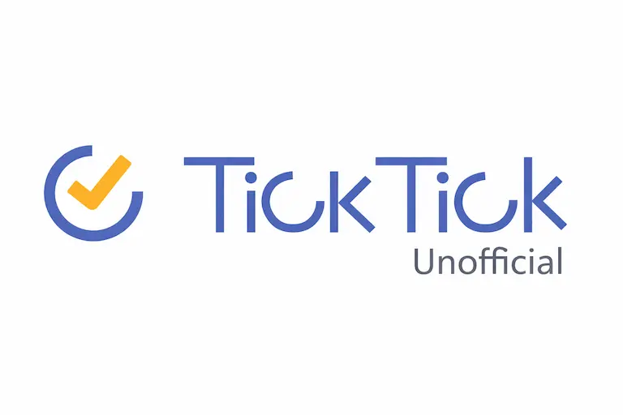

<div align="center">
  

  <h1>TickTick Unofficial</h1>

  <p>Unofficial TickTick tooling for private web API access, automation, and self-hosted workflows.<br/>The official APIs are too lame!</p>

  <p>
    <a href="https://github.com/Nyrest/ticktick-unofficial/actions/workflows/ci.yml"></a>
  </p>
</div>

## ✨ Features

- ✔️ **The most comprehensive** implementation
  - Includes `Pomodoro`, `Focus`, `Statistics`, `Countdown`, etc...
  - Supports both TickTick and Dida365
  - Heavily tested
  - Provides library, CLI, and API interfaces

- 🪛 **Modern** tech stack
  - Full TypeScript with strict types
  - Bun runtime for speed and native tooling
  - Turborepo monorepo for modularity and efficient builds
  - Playwright for reliable endpoint testing
  - OpenAPI spec for the API app

- 🧑‍💻 **Developer-friendly** design
  - Resource-oriented SDK with high-level modules
  - Comprehensive documentation and examples
  - Easy local development with hot reload
  - Explicit `client.session` and `client.raw` namespaces

## Supported Modules

The shared `node-ticktick-unofficial` library currently exposes these supported modules:

| Module | What it covers | Typical use |
| --- | --- | --- |
| `client.user` | Account profile data | Identify the current account and inspect profile details |
| `client.projects` | Projects and columns | List projects, inspect structure, and work with project metadata |
| `client.tasks` | Tasks and task sync data | Read, create, update, move, complete, reopen, and delete tasks |
| `client.countdowns` | Countdowns and anniversaries | List, create, update, and remove countdown-style items |
| `client.habits` | Habits, check-ins, and exports | Read habit data, record check-ins, and export habit information |
| `client.focus` | Focus session state and history | Start, pause, resume, finish, stop, and inspect focus sessions |
| `client.pomodoros` | Alias for focus controls | Use the same focus functionality with pomodoro-oriented naming |
| `client.statistics` | General and ranking statistics | Read account-level stats, rankings, and task-related statistics |
| `client.session` | Session lifecycle | Restore, validate, refresh, clear, and inspect the active session |
| `client.raw.requestJson()` / `client.raw.request()` / `client.raw.requestBuffer()` | Raw endpoint access | Reach lower-level private endpoints when the higher-level modules are not enough |

TickTick is the default target. Dida365 is supported with the same overall shape.

## Pick The Right Package

### `packages/node-ticktick-unofficial`

Use this if you want to build your own integration, backend route, cron job, or agent workflow.

Good fit for:

- custom automations
- personal dashboards
- internal tools
- server-side scripts

### `apps/ticktick-unofficial-cli`

Use this if you want to manage TickTick from a terminal with readable output or JSON for scripts.

Good fit for:

- quick daily operations
- shell scripts
- AI agents
- local automation

### `apps/ticktick-unofficial-api`

Use this if you want a simple HTTP layer on top of one TickTick account.

Good fit for:

- self-hosted personal API access
- connecting other tools over HTTP
- exposing OpenAPI docs for your own workflows

## Quick Start

Install dependencies from the repo root:

```bash
bun install
```

Validate the monorepo:

```bash
bun run typecheck
bun run build
```

Turbo is wired in at the repo root, so these commands now run through the workspace dependency graph with caching enabled.

Add Turborepo to this Bun workspace with:

```bash
bun install turbo --dev
```

## Typical Ways To Use It

Use the library in your own server code:

```ts
import { TickTickClient, createFileSessionStore } from "node-ticktick-unofficial";

const client = await TickTickClient.create({
  credentials: {
    username: process.env.TICKTICK_USERNAME!,
    password: process.env.TICKTICK_PASSWORD!,
  },
  sessionStore: createFileSessionStore(".ticktick/session.json"),
});

const tasks = await client.tasks.listActive();
const task = await client.tasks.create({ title: "Write release notes" });
const sameTask = await client.tasks.get(task.id);

console.log(tasks.length);
```

Use the CLI for everyday actions:

```bash
ticktick-unofficial-cli whoami
ticktick-unofficial-cli task list --project inbox
ticktick-unofficial-cli task add "Write release notes" --project Work
ticktick-unofficial-cli focus start --duration 25
```

Run the API locally:

```dotenv
TICKTICK_USERNAME=your-account@example.com
TICKTICK_PASSWORD=your-password
```

```bash
bun run --cwd apps/ticktick-unofficial-api dev
```

## Monorepo Layout

```text
.
├─ packages/
│  └─ node-ticktick-unofficial/
└─ apps/
   ├─ ticktick-unofficial-cli/
   └─ ticktick-unofficial-api/
```

## Workspace Docs

- Library docs: [`packages/node-ticktick-unofficial/README.md`](packages/node-ticktick-unofficial/README.md)
- API docs: [`apps/ticktick-unofficial-api/README.md`](apps/ticktick-unofficial-api/README.md)
- CLI docs: [`apps/ticktick-unofficial-cli/README.md`](apps/ticktick-unofficial-cli/README.md)

## Workspace Commands

Root commands:

```bash
bun run typecheck
bun run build
```

Targeted builds:

```bash
bun run build:client
bun run build:cli
bun run build:api
```

Direct Turbo usage:

```bash
bunx turbo run build
bunx turbo run typecheck
bunx turbo run build --filter=node-ticktick-unofficial
bunx turbo run build --filter=ticktick-unofficial-api
```

Workspace-local validation:

```bash
bun run --cwd packages/node-ticktick-unofficial typecheck
bun run --cwd apps/ticktick-unofficial-cli typecheck
bun run --cwd apps/ticktick-unofficial-api typecheck
```

## Important Notes

- This project uses private web endpoints, not TickTick's official public API.
- Upstream changes can break behavior without warning.
- The library is intended for server-side use, not browser use.

## More Detail

- Library docs: `packages/node-ticktick-unofficial/README.md`
- CLI docs: `apps/ticktick-unofficial-cli/README.md`
- API docs: `apps/ticktick-unofficial-api/README.md`
